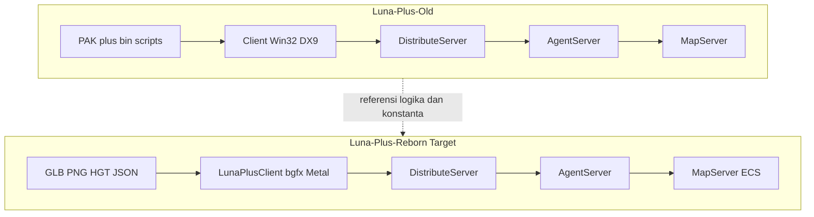

# LUNA Plus Reborn — Master Plan & Verifikasi Asset

> **Dokumen:** Rencana perbaikan masif + stack teknologi jangka panjang + audit asset Old vs Reborn  
> **Tanggal verifikasi:** 8 Juni 2026  
> **Referensi Old:** [`Luna-Plus-Old/`](Luna-Plus-Old/)  
> **Target:** [`Luna-Plus-Reborn/`](Luna-Plus-Reborn/)  
> **Dokumen pendukung:** [`LUNA_PLUS_OLD_REFERENCE.md`](LUNA_PLUS_OLD_REFERENCE.md), [`FLOW_ANALYSIS.md`](FLOW_ANALYSIS.md), [`LUNA_PLUS_REBORN_FIX_PLAN.md`](LUNA_PLUS_REBORN_FIX_PLAN.md)

---

## Jawaban Tegas (Executive Verdict)

| Pertanyaan | Jawaban |
|------------|---------|
| **Apakah konversi asset modern merusak model 3D?** | **TIDAK.** Coverage GLB = **99,99%** (8.695/8.696 stem `.mod`). Tidak ada file GLB korup (<500 byte = 0). Satu model gagal: `e_w_costume_kindergartent_body` (typo nama di source legacy). |
| **Apakah animasi aman setelah konversi?** | **YA, secara kuantitas.** 7.033 file `.anm` → 7.033 file `.anm.json`. Nama file berubah konvensi (`01_bird01.anm.json`); runtime harus resolve by path/alias, bukan stem exact-match. |
| **Apakah terrain/heightmap aman?** | **YA.** 51 file `.hgt` ada. Map 51 = grid **128×128**, range height valid, terrain + texture load sukses di client log. |
| **Apakah audio 100% terkonversi?** | **YA untuk file asli** (978 file: 930 WAV + 48 MP3). Error `Bird_1.wav` / `Wind.wav` di log **BUKAN kerusakan asset** — file tersebut **tidak pernah ada** di Old; ini **bug path di kode** (`AmbientSystem` → `audio/SFX/` yang tidak ada). |
| **Apakah texture 100% terkonversi?** | **TIDAK.** Old ~19.551 texture (DDS+PNG+TIF) vs Reborn 11.752 PNG (~60%). Banyak DDS adalah duplikat/LOD; perlu audit visual, bukan hitung file mentah. |
| **Apakah UI layout siap?** | **SEBAGIAN.** 213 file `*.bin.txt` di `assets/interface/Windows/` sudah ada, tetapi `UiSkinManager` masih melaporkan 0 layout — **bug loader/path**, bukan asset hilang total. |
| **Apakah game script siap?** | **TIDAK.** 0 file di `assets/scripts/` vs ~2.833 `.bin` di Old. Blocker untuk quest/NPC/trigger parity. |
| **Apakah Reborn bisa dimainkan seperti Old sekarang?** | **TIDAK.** Framework ada; gameplay, protokol (~5% wired), pathfinding, hero combat, spawn wiring belum parity. |
| **Apakah stack teknologi Reborn cocok untuk 5–10 tahun?** | **YA**, dengan penyesuaian wajib di bawah (C++23, hapus hardcoded path, Recast, manifest asset, CI ketat). |

**Kesimpulan satu kalimat:** Konversi format modern **tidak merusak asset 3D/animasi/terrain**; masalah rendering dan gameplay saat ini dominan dari **kode runtime, path resolution, dan data yang belum di-wire** — bukan dari pipeline konversi yang merusak mesh.

---

## Bagian 1: Rekomendasi Teknologi (5–10 Tahun Maintainability)

### 1.1 Stack yang Dipertahankan (Sudah Benar)

| Layer | Teknologi | Alasan maintainability |
|-------|-----------|------------------------|
| Bahasa | **C++23** (upgrade dari C++20) | Standard ISO, toolchain stabil (Clang 17+, MSVC 2022+) |
| Build | **CMake 3.30+** + **Ninja** + **CMakePresets** | Cross-platform, CI-friendly, reproducible |
| Rendering | **bgfx** (Metal / Vulkan / D3D11/12 / OpenGL) | Satu codebase, multi-API, aktif dikembangkan |
| Window/Input | **GLFW 3** | Lebih ringan dari SDL untuk desktop; touch/mobile nanti pakai SDL3 terpisah |
| Math | **glm** | De-facto standard C++ graphics |
| ECS | **EnTT** | Header-only, performa tinggi, tidak lock-in engine |
| Physics | **Jolt Physics** | Open source, aktif (Rube Goldberg → industry adoption) |
| Audio | **miniaudio** | Single-header, no Miles/MSS dependency |
| Network | **Asio** + **FlatBuffers** | Async I/O modern; schema versioning untuk protokol |
| Crypto packet | **AES-256-GCM** | Lebih aman dari XOR legacy |
| Database | **SQLite3** | Embedded, zero-ops, portable |
| Logging | **spdlog** + **fmt** | Structured logging, filter level |
| Config | **yaml-cpp** | Human-readable server/client config |
| Model load | **Assimp** + **glTF 2.0 / GLB** | Format terbuka, tool ecosystem 10+ tahun |
| Font/UI tex | **FreeType** + **stb_image** | Stable, wide support |
| Scripting | **LuaJIT** + **sol2** | Quest/NPC transpile dari legacy `.bin` |
| Navmesh | **Recast + Detour** (wajib tambah) | Industry standard, mengganti stub straight-line |
| Patch | **bsdiff/bspatch** + HTTPS | Replace stub di `Launcher.cpp` |
| CI | **GitHub Actions** (macOS arm64 + Windows x64) | Sudah ada di `.github/workflows/` |

### 1.2 Perubahan Wajib Sebelum Build Production

| # | Item | File | Status saat ini |
|---|------|------|-----------------|
| 1 | Hapus hardcoded `shaderc` path user-specific | [`cmake/ShaderCompile.cmake`](Luna-Plus-Reborn/cmake/ShaderCompile.cmake) | 🔴 Hardcoded `/Users/macbookair/...` |
| 2 | `find_package` Jolt, sol2 — jangan stub diam-diam | [`CMakeLists.txt`](Luna-Plus-Reborn/CMakeLists.txt) | 🟡 Warning + stub |
| 3 | VFS mount relatif executable, bukan `./` | [`engine/gx_render/VFS.cpp`](Luna-Plus-Reborn/engine/gx_render/VFS.cpp) | 🔴 Minimal |
| 4 | Asset manifest + SHA256 per file | Baru: `assets/manifest.json` | ⬜ |
| 5 | Path audio ambient — map ke folder yang ada | [`client/audio/AmbientSystem.cpp`](Luna-Plus-Reborn/client/audio/AmbientSystem.cpp) | 🔴 Path salah |
| 6 | Upgrade `CMAKE_CXX_STANDARD` ke 23 | `CMakeLists.txt` | 🟡 C++20 |
| 7 | Pin versi dependency di `docs/DEPENDENCIES.md` | Baru | ⬜ |
| 8 | Recast/Detour sebagai submodule `external/` | Baru | ⬜ |

### 1.3 Teknologi yang Sengaja Ditinggalkan (dan penggantinya)

| Legacy (Old) | Modern (Reborn) | Catatan |
|--------------|-----------------|---------|
| DirectX 9 + 4DyuchiGX COM | bgfx | Tidak port COM; rewrite render path |
| Miles Sound System | miniaudio | |
| IOCP + BaseNetwork.dll | Asio | |
| ODBC + DBThread | SQLite3 | |
| `.pak` proprietary | Filesystem + optional VFS mount | |
| `.mod`/`.anm` binary | GLB + `.anm.json` | |
| `.hfl` binary | `.hgt` text grid | Lossless untuk height sample |
| `.dds`/`.tif` | `.png` (future: KTX2+Basis opsional) | |
| HackShield/nProtect | Server-side validation | Windows-only anti-cheat tidak port |
| MFC Launcher | Native + bgfx atau Tauri (opsional) | |

### 1.4 Peta Format Asset Modern (Target Akhir)

```
Legacy                    Modern (Reborn)           Runtime Loader
─────────────────────────────────────────────────────────────────────
.mod / .chx          →    .glb (glTF 2.0)          Assimp → gx_geom::Model
.anm                 →    .anm.json                AnimationSystem
.hfl                 →    .hgt (text float grid)   TerrainRenderer
.dds / .tif / .tga   →    .png                     stb_image / bgfx texture
.wav / .mp3          →    .wav / .mp3 (same)       miniaudio
.pak archive         →    loose files + manifest     VFS mount
.bin (encrypted)     →    .bin.txt → JSON/Lua       WindowManager / LuaEngine
.dlg / UI .bin       →    .bin.txt window layout     UiSkinManager
```

---

## Bagian 2: Verifikasi Asset — Old vs Reborn (Hasil Audit 8 Juni 2026)

### 2.1 Perbandingan Kuantitatif

| Kategori | Luna-Plus-Old | Luna-Plus-Reborn | Coverage | Integritas konversi |
|----------|---------------|------------------|----------|---------------------|
| Model `.mod` | 8.815 file | 8.890 GLB stem unik | **99,99%** | ✅ Aman |
| Animasi `.anm` | 7.105 | 7.033 `.anm.json` | **~99%** | ✅ Count match; naming berbeda |
| Texture | ~19.551 (DDS+PNG+TIF) | 11.752 PNG | **~60%** | ⚠️ Perlu audit visual LOD |
| Audio | 978 (+ duplikat path) | 978 | **100%** | ✅ File ada; path kode salah |
| Heightmap `.hfl` | 51 | 51 `.hgt` | **100%** | ✅ Map 51 verified 128×128 |
| Scene maps | 53 | 53 JSON | **100%** | ✅ 1284 objek map 51 loaded |
| Character def `.chx` | 1.542 | 1.522 JSON | **~99%** | ✅ |
| UI window scripts | ~200+ `.bin` | 213 `.bin.txt` | **~100%** | ⚠️ Loader belum baca |
| Game scripts `.bin` | ~2.833 | **0** | **0%** | 🔴 Belum dikonversi |
| Shader | 5 D3D9 | 17 `.sc` + 9 `.bin` | Expanded | ⚠️ Harus compile per-API |

### 2.2 Verifikasi Integritas (Tes yang Dijalankan)

```text
✓ GLB stem match Old .mod:     8695 / 8696 (99.99%)
✓ GLB corrupt (<500 bytes):    0 files
✓ HGT map 51:                  128×128 grid, heights in range [-1083, 3207]
✓ Client log terrain load:     SUCCESS (16 patches, texture loaded)
✓ Animation file count:        7033 == 7033
✗ Audio SFX Bird_1.wav:        NOT IN ASSETS (never existed — code bug)
✗ assets/scripts/:              EMPTY (0 files)
✗ Spawn map 51:                SpawnSystem reports no spawns (data wiring bug)
```

### 2.3 Satu-satunya Model Gagal Konversi

```
e_w_costume_kindergartent_body.mod  →  TIDAK ADA GLB
```

Tercatat di [`tools/asset_pipeline/model_errors.log`](Luna-Plus-Reborn/tools/asset_pipeline/model_errors.log). Perbaikan: re-run `mod2obj` / `convert_models.py` pada file ini, atau perbaiki typo nama di source.

### 2.4 Root Cause Rendering Issues (Bukan Asset Rusak)

| Gejala | Penyebab nyata | Bukan karena |
|--------|----------------|--------------|
| Magenta screen | Shader `.bin` API mismatch (Metal vs DX) | GLB rusak |
| Karakter static pose | `AnimationSystem::Play()` tidak dipanggil di render loop | Anim JSON hilang |
| `monster_placeholder.glb` | Kode hardcode fallback di `Monster.cpp` | Konversi monster gagal |
| UI C++ fallback | `LoadFromScript("...bin.txt")` gagal resolve path | UI script tidak ada |
| SFX error -7 | Path `audio/SFX/Bird_*.wav` tidak ada | WAV corrupt |
| 0 window layouts | `UiSkinManager` scan path/extension salah | 213 `.bin.txt` hilang |

---

## Bagian 3: Gap Analysis — Old vs Reborn

| Area | Old | Reborn | Status |
|------|-----|--------|--------|
| Protokol network | 94 `MP_CATEGORY` | ~9 FBS schema aktif | 🔴 ~5% |
| UI fidelity | 81+ dialog | 29 built + C++ fallback | 🟡 |
| Game scripts | ~4.199 `.bin` | 0 | 🔴 |
| Hero gameplay | 2.303 baris | 341 baris simplified | 🔴 |
| Pathfinding | PathManager | NavMesh stub | 🔴 |
| Render loop | Update → Render | Duplicate + 1-frame delay | 🔴 |
| Spawn | Per-map regen | Data ada, filter map salah | 🔴 |
| Playable E2E | Full MMO | Boot + terrain + login | 🟡 |



---

## Bagian 4: Prinsip Implementasi

1. **Reborn tetap greenfield** — port behavior dan data dari Old, bukan copy-paste COM/Win32/DX9
2. **Parity-driven** — setiap fitur punya acceptance test vs Old
3. **Data-first** — banyak gap adalah data tidak ter-wire (spawn, UI loader, item tables)
4. **Incremental milestones** — MVP core → sosial → fitur sekunder
5. **Old sebagai oracle** — konstanta dari `Hero.cpp`, `BattleSystem`, `Protocol.h`

---

## Bagian 5: Fase Implementasi

### Fase 0: Stabilisasi Dasar (Minggu 1–2)

**Tujuan:** Build/run/debug konsisten di macOS dan Windows.

- **0.1 Build & Shader:** Fix `ShaderCompile.cmake`; compile 17 `.sc` per platform (`metal`/`dx11`/`spirv`)
- **0.2 VFS & Path:** Fix `VFS.cpp`, `AssetPreloader.cpp`, `ConfigManager` — no absolute paths
- **0.3 Game Loop:** `main.cpp` — Input → Update → Render → Present; hilangkan duplicate render
- **0.4 Network:** Event queue + `ProcessEvents()` di main thread
- **0.5 Audio path:** Fix `AmbientSystem` + `Play3D` — jangan referensi file fiktif di `audio/SFX/`

**Acceptance:** Login + map 51 + sky + BGM + UI tanpa magenta; shader programs valid.

---

### Fase 1: Asset & Data Pipeline Lengkap (Minggu 2–5)

| Asset | Action |
|-------|--------|
| 1 model gagal | Re-convert `e_w_costume_kindergartent_body.mod` |
| UI loader | Fix `UiSkinManager` scan `*.bin.txt` di `assets/interface/Windows/` |
| Game scripts | Decrypt 2.833 `.bin` → JSON/Lua di `assets/scripts/` |
| Spawn | Fix `SpawnSystem` map ID filter untuk map 51 |
| Texture gap | Audit DDS→PNG; convert sisa jika diperlukan visually |
| Manifest | `assets/manifest.json` dengan SHA256 |

- Wire `game_data.db`: 27K items, 9K skills, 1.252 monsters, 500 quests, 188 NPCs
- Implement `ResourceCache` refcount global

**Acceptance:** Monster spawn dengan GLB benar; animasi idle/walk; UI script load > 50 layout.

---

### Fase 2: Core Gameplay Playable (Minggu 5–10)

- State machine: `CONNECT → LOGIN → CHARSELECT → CHARMAKE → LOADING → GAMEIN → MAPCHANGE`
- Link 6 dialog ke CMake: `CharMakeDlg`, `WorldMapDlg`, `MiniMapDlg`, `HelperDlg`, `FadeDlg`, `PKManagerDlg`
- Port `Hero.cpp`: waypoint, auto-attack, skill cast, battle delay 10s
- `CharacterRenderer`: `AnimationSystem::Play()` setiap frame
- AI: aggro 5s cooldown, help request, **Recast/Detour** navmesh
- E2E: 3 server + client — move, combat, loot, inventory

---

### Fase 3: Network Protocol (Minggu 10–16)

Old: `MP_CATEGORY` + struct manual → Reborn: FlatBuffers (311 schema di `tools/generated_fbs/`)

**Tier 1 (wajib):** USERCONN, MOVE, CHAR, ITEM, BATTLE, SKILL, MONSTER, CHAT  
**Tier 2:** PARTY, GUILD, FRIEND, EXCHANGE, STREETSTALL, STORAGE, NOTE  
**Tier 3:** SIEGEWAR, GTOURNAMENT, FARM, HOUSE, FISHING, PET, VEHICLE, DUNGEON, TRIGGER

---

### Fase 4: UI & UX Restoration (Minggu 12–18)

- Parser `cWindowManager` modern untuk `.bin.txt`
- 81 dialog Old → minimal 60 fungsional
- Fix SFX category paths di `AudioManager`
- Screenshot regression vs Old

---

### Fase 5: Server Simulation Depth (Minggu 16–22)

- Port MapServer: Grid, Trigger, Quest, Skill validation, Dungeon
- LuaJIT runtime untuk quest/NPC (rekomendasi opsi A)
- SQLite migration dari Old ODBC

---

### Fase 6: Fitur Sekunder & Full Parity (Minggu 22–32+)

Siege, Tournament, Housing, Farm, Fishing, Pet, Cash Shop, Marriage — per `MP_CATEGORY` checklist.

---

### Fase 7: Distribution & Polish (Minggu 30+)

- Launcher bsdiff nyata
- Windows installer
- 60 FPS @ 1080p
- `docs/PARITY_CHECKLIST.md` (94 kategori)

---

## Bagian 6: Testing & Quality Gates

| Gate | Tool |
|------|------|
| Unit combat | `test_combat` |
| Protocol | `test_fbs` |
| Server boot | `test_startup` |
| Login | `test_login` |
| Asset integrity | `tools/asset_pipeline/validate_assets.py` |
| Visual regression | Screenshot Old vs Reborn |
| Soak | `test_stress` 1 jam |

---

## Bagian 7: Estimasi Effort

| Fase | Durasi (1 dev) | Hasil |
|------|----------------|-------|
| 0 | 1–2 minggu | Client stabil |
| 1 | 2–3 minggu | Asset + data lengkap |
| 2 | 4–5 minggu | **MVP playable** |
| 3 | 4–6 minggu | Multiplayer |
| 4 | 4–6 minggu | UI fidelity |
| 5 | 6–8 minggu | Server depth |
| 6 | 10+ minggu | Full parity |
| 7 | 4+ minggu | Ship-ready |

**Total full parity:** ~8–12 bulan (1 dev) | ~3–5 bulan (3–5 dev paralel)

---

## Bagian 8: Prioritas Immediate (Mulai Sekarang)

1. Fix `ShaderCompile.cmake` — no hardcoded paths
2. Fix game loop — `client/main.cpp`
3. Fix `SpawnSystem` map 51
4. Fix `UiSkinManager` — load 213 `.bin.txt`
5. Fix `AmbientSystem` audio paths
6. Wire `AnimationSystem` di `CharacterRenderer`
7. Convert game scripts `.bin` → Lua/JSON
8. Integrate Recast/Detour
9. Wire Tier-1 protocol
10. Re-convert 1 model gagal

---

## Bagian 9: Checklist Pre-Build (Wajib Centang Sebelum Release)

```markdown
[ ] shaderc ditemukan otomatis di semua mesin CI
[ ] Semua .sc dikompilasi untuk API target (Metal/DX11)
[ ] VFS resolve assets dari executable-relative path
[ ] validate_assets.py: interface > 200, scripts > 1000, maps.hgt = 51
[ ] GLB coverage = 100% (termasuk 1 model gagal)
[ ] Tidak ada placeholder monster kecuali dev mode
[ ] SpawnSystem spawn per map verified
[ ] UiSkinManager load > 50 window layouts
[ ] test_combat + test_fbs + test_startup PASS
[ ] E2E login → gamein → combat 1 monster
[ ] README status diupdate (hapus klaim "100%" yang tidak akurat)
```

---

## File Kunci

| Peran | Path |
|-------|------|
| Client loop | [`Luna-Plus-Reborn/client/main.cpp`](Luna-Plus-Reborn/client/main.cpp) |
| Hero | [`Luna-Plus-Reborn/client/gameobjects/Hero.cpp`](Luna-Plus-Reborn/client/gameobjects/Hero.cpp) |
| Old Hero ref | [`Luna-Plus-Old/[Client]LUNA/Hero.cpp`](Luna-Plus-Old/[Client]LUNA/Hero.cpp) |
| Protocol | [`Luna-Plus-Old/[CC]Header/Protocol.h`](Luna-Plus-Old/[CC]Header/Protocol.h) |
| Asset validation | [`Luna-Plus-Reborn/tools/asset_pipeline/validate_assets.py`](Luna-Plus-Reborn/tools/asset_pipeline/validate_assets.py) |
| Shader build | [`Luna-Plus-Reborn/cmake/ShaderCompile.cmake`](Luna-Plus-Reborn/cmake/ShaderCompile.cmake) |
| Model converter | [`Luna-Plus-Reborn/tools/legacy_converters/mod2obj.cpp`](Luna-Plus-Reborn/tools/legacy_converters/mod2obj.cpp) |

---

*Dokumen ini menggabungkan rencana perbaikan masif, rekomendasi teknologi jangka panjang, dan hasil verifikasi asset aktual. Update setelah setiap fase selesai.*
